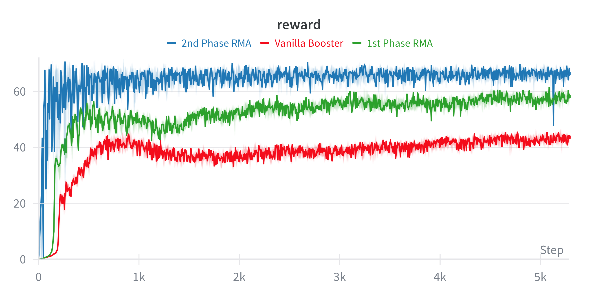
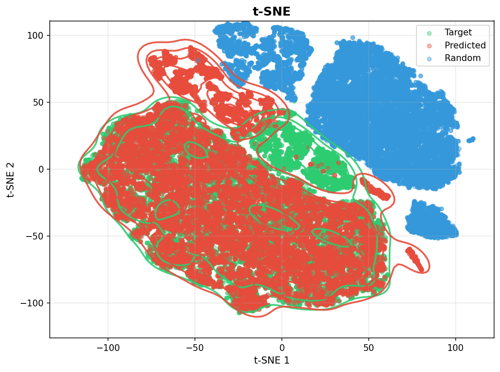

# An RMA-Based Approach for Booster T1 Running Control

**TUM Advanced Deep Learning for Robotics (ADLR) — Winter Semester 2025/26**

**Authors:** Can Lin, Zhongxun Zhao

This project implements a whole-body locomotion controller for the Booster T1 humanoid robot using Rapid Motor Adaptation (RMA). Built on top of [Booster Gym](https://github.com/BoosterRobotics/booster_gym), we extend the framework with a two-phase training pipeline that enables the robot to adapt online to varying physical conditions using only proprioceptive feedback.

## RMA Pipeline

<!-- Replace with your pipeline figure -->


The training follows a two-phase Rapid Motor Adaptation strategy:

- **Phase 1 (Expert):** A base policy is trained with access to privileged environment information (friction, mass, external forces) via an encoder that maps these into a compact latent embedding. The policy learns optimal behaviors conditioned on this embedding.
- **Phase 2 (Student):** The base policy is frozen, and an adaptation module (1D ConvNet) is trained to regress the same latent embedding from a history of proprioceptive observations. This removes the dependency on privileged information at deployment time.

## Key Contributions

- **Full-body control:** Unlike the Booster Gym baseline which locks upper-body DOFs, our policy actively controls all 21 joints including arms and torso.
- **Two-phase RMA training:** Enables implicit online adaptation to environmental variations (friction, mass, disturbances) without explicit system identification.
- **Symmetry loss:** An auxiliary loss that enforces left-right symmetric gaits, preventing convergence to asymmetric "limping" behaviors.
- **Arm-swing synergy reward:** A novel reward term that encourages anti-phase coordination between ipsilateral arm and leg, producing bio-plausible angular momentum cancellation.

## Project Structure

```
├── train.py                # Phase 1: Train base policy with privileged info
├── train2.py               # Phase 2: Train adaptation module
├── play.py                 # Evaluate policy in Isaac Gym
├── play_mujoco.py          # Cross-simulation evaluation in MuJoCo
├── export_model.py         # Export policy to TorchScript (.pt)
├── export_encoder.py       # Export encoder separately
├── extract_embeddings.py   # Extract and save latent embeddings
├── envs/
│   ├── t1.py               # T1 humanoid environment definition
│   ├── T1.yaml             # Training configuration
│   └── base_task.py        # Base environment (Isaac Gym integration)
├── utils/
│   ├── model.py            # RMA neural network architecture
│   ├── runner.py           # Training and evaluation loop
│   ├── buffer.py           # Experience replay buffer
│   ├── recorder.py         # TensorBoard and W&B logging
│   ├── terrain.py          # Terrain generation
│   └── wrapper.py          # Observation stacking wrapper
├── resources/
│   └── T1/                 # URDF and MuJoCo robot models
└── requirements.txt
```

## Installation

1. Create a conda environment with Python 3.8:

    ```sh
    conda create --name booster python=3.8
    conda activate booster
    ```

2. Install PyTorch with CUDA support:

    ```sh
    conda install numpy=1.21.6 pytorch=2.0 pytorch-cuda=11.8 -c pytorch -c nvidia
    ```

3. Install Isaac Gym:

    Download Isaac Gym Preview 4 from [NVIDIA's website](https://developer.nvidia.com/isaac-gym/download), then:

    ```sh
    tar -xzvf IsaacGym_Preview_4_Package.tar.gz
    cd isaacgym/python
    pip install -e .
    ```

    Configure shared libraries for the conda environment:

    ```sh
    cd $CONDA_PREFIX
    mkdir -p ./etc/conda/activate.d
    echo 'export OLD_LD_LIBRARY_PATH=${LD_LIBRARY_PATH}' >> ./etc/conda/activate.d/env_vars.sh
    echo 'export LD_LIBRARY_PATH=$LD_LIBRARY_PATH:$CONDA_PREFIX/lib' >> ./etc/conda/activate.d/env_vars.sh
    mkdir -p ./etc/conda/deactivate.d
    echo 'export LD_LIBRARY_PATH=${OLD_LD_LIBRARY_PATH}' >> ./etc/conda/deactivate.d/env_vars.sh
    echo 'unset OLD_LD_LIBRARY_PATH' >> ./etc/conda/deactivate.d/env_vars.sh
    ```

4. Install dependencies:

    ```sh
    pip install -r requirements.txt
    ```

## Usage

### Phase 1: Train Base Policy

```sh
python train.py --task=T1
```

This trains the expert policy with access to privileged environment parameters. Models and logs are saved to `logs/<date-time>/`.

### Phase 2: Train Adaptation Module

```sh
python train2.py --task=T1 --encoder=-1
```

Loads the Phase 1 checkpoint (use `-1` for latest) and trains the adaptation module to regress latent embeddings from observation history.

### Evaluation

**Isaac Gym** (same simulator as training):
```sh
python play.py --task=T1 --checkpoint=-1
```

**MuJoCo** (cross-simulation generalization):
```sh
python play_mujoco.py --task=T1 --checkpoint=-1
```

### Export Model

```sh
python export_model.py --task=T1 --checkpoint=-1
```

### Common Arguments

| Argument | Description |
|---|---|
| `--task` | Task name (default: `T1`) |
| `--checkpoint` | Model path or `-1` for latest |
| `--encoder` | Phase 1 checkpoint for Phase 2 training |
| `--num_envs` | Number of parallel environments |
| `--sim_device` | Physics simulation device (e.g. `cuda:0`) |
| `--rl_device` | RL algorithm device (e.g. `cuda:0`) |
| `--headless` | Run without viewer window |
| `--seed` | Random seed |
| `--max_iterations` | Maximum training iterations |

### Progress Tracking

TensorBoard:
```sh
tensorboard --logdir logs
```

Weights & Biases:
```sh
wandb login
```

W&B can be disabled by setting `use_wandb: false` in `envs/T1.yaml`.

## Results

### Training Curves

<!-- Replace with your reward curve figure -->


| Policy | Asymptotic Reward |
|---|---|
| Vanilla Booster (baseline) | ~40 |
| Expert (Phase 1, privileged) | ~55 |
| Student (Phase 2, adaptive) | ~65 |

The Student policy outperforms even the Expert, which we attribute to the regularization effect of the adaptation information bottleneck filtering out high-frequency noise in the privileged state space.

### Embedding Analysis

<!-- Replace with your t-SNE figure -->


t-SNE visualization confirms that the adaptation module learns a faithful representation of the environment parameters. Predicted embeddings (from proprioceptive history) closely overlap with target embeddings (from privileged encoder), achieving a mean cosine similarity of **0.807**.

## Acknowledgements

This project is built on top of [Booster Gym](https://github.com/BoosterRobotics/booster_gym) by Booster Robotics. The RMA architecture follows [Kumar et al., 2021](https://arxiv.org/abs/2107.04034).
